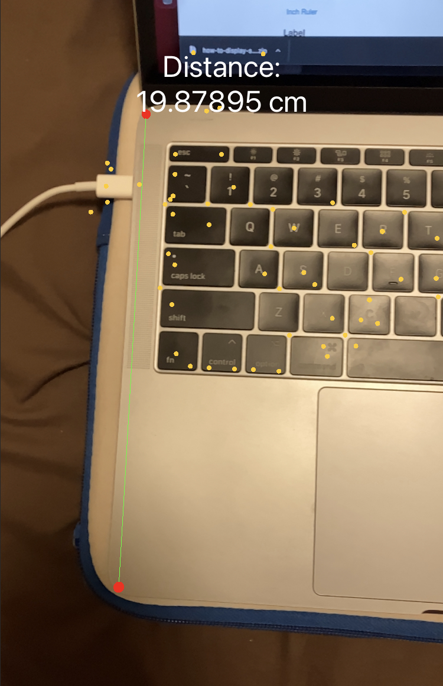

Simple AR ruler
===================

## This project shows you how to:
- detect touch location on the scene
- add SCNSphere as SCNNode to the scene
- measure distance of two nodes
- display UILabel on scene
- create line in between two nodes

